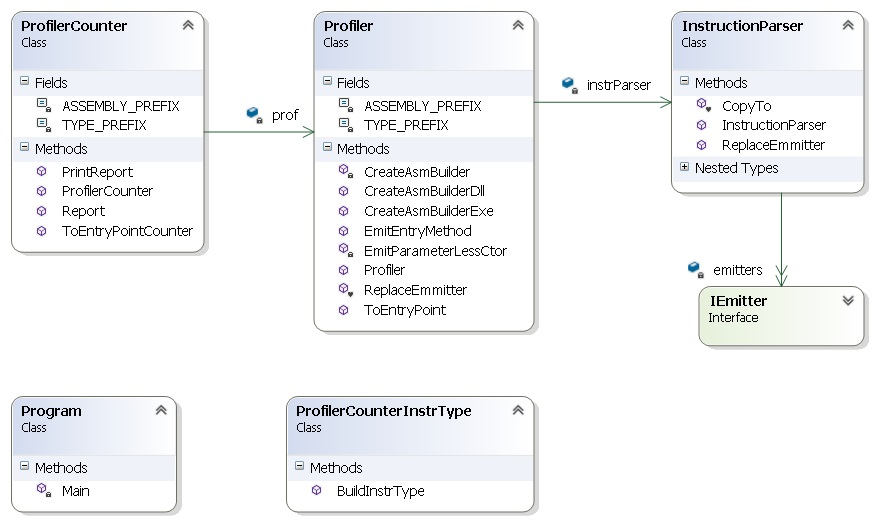

## guião da parte 2 da da primeira série de exercícios

###Estrutura##

Evitar a repetição de código entre as classes Profiler e ProfilerCounter. Neste sentido poderão adicionar/mudar assinaturas de métodos ou campos para conseguir a melhor integração entre os dois tipos:

A solução profilerfw (https://github.com/isel-leic-ave/ave-2014-15-sem2-serie1-profilerfw) tem os seguintes projectos:

  * profilerfw -- projecto principal da framework profilerfw
  * ProfilerFwTest -- testes unitários
  * TestInheritance (pasta test) -- produz uma Dll que é usada na execução da aplicação profilerfw e nos testes unitários ProfilerFwTest.
  * TestInheritance-- produz uma Dll que reutiliza o RestSharp e que é usada na execução da aplicação profilerfw e nos testes unitários ProfilerFwTest.

###Faseamento do trabalho da parte 2##

* Objectivo 1: conseguir que o resultado da chamada a ToEntryPointCounter(typeof(Xpto), "Foo"), gere uma classe InstrXpto em que o método Foo faz o mesmo que o método Xpto::Foo, mas no final faz a chamada ao método estático ProfilerCounter:: PrintReport. Por sua vez o método ProfilerCounter:: PrintReport faz só um WriteLine na consola "Hello World".

* Objectivo 2: 

  a. construir uma classe auxiliar ProfilerCounterInstrType com um método: Type BuildInstrType(Type src, TypeBuilder dest) que retorna um novo tipo que estende src e que redefine os seus métodos virtuais com: 1) chamada ao mesmo método da base; 2) chamada a um método de ProfilerCounter que registe que este método foi executado.
        
  b. implementar um teste unitário que verifique o correcto funcionamento da alínea a. do Objectivo 2.

* Objectivo 3: completar a funcionalidade de ToEntryPointCounter substituindo a instanciação de cada classe por uma nova classe resultante da chamada ao BuildInstrType implementado no Objectivo 2.

